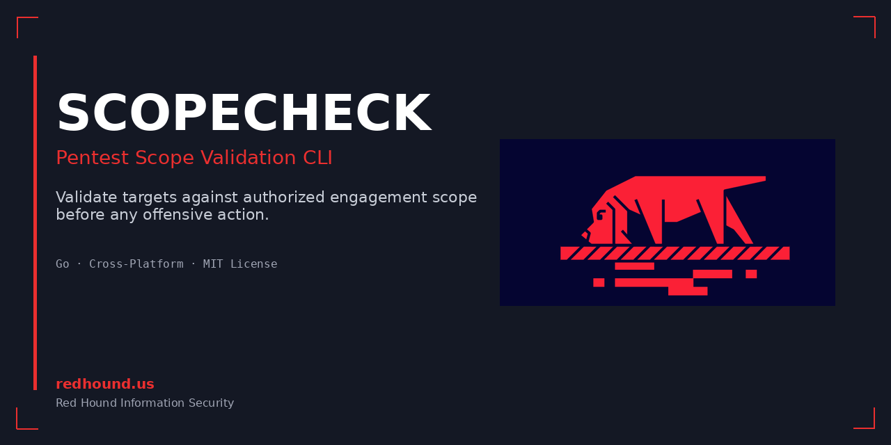

<p align="center">
  
</p>

# scopecheck

**Validate targets against authorized engagement scope before any offensive action.**

```
  scopecheck validate 192.168.1.50 10.20.30.40 mail.acme.com

  ✓ 192.168.1.50       IN SCOPE    (matches 192.168.1.0/24)
  ✗ 10.20.30.40        OUT OF SCOPE
  ✗ mail.acme.com      EXCLUDED    (excluded: mail.acme.com)
```

## What It Does

scopecheck is a cross-platform CLI tool that checks whether targets (IPs, CIDRs, domains) fall within your authorized engagement scope. It reads a YAML scope definition and validates targets against it, producing clear pass/fail output with an audit trail.

## Who It Is For

- Penetration testers
- Red team operators
- Purple team members
- Security consultants
- Bug bounty hunters
- Anyone conducting authorized security assessments

## Authorized Use Statement

This tool is designed exclusively to support **legitimate, authorized security testing**. It is a safety tool that helps operators stay within authorized boundaries. Always ensure you have written authorization before conducting any security assessment.

## What It Does NOT Do

- Does NOT scan, probe, or interact with any target system
- Does NOT resolve DNS names (pure string/CIDR matching)
- Does NOT parse scope documents (PDFs, emails, contracts)
- Does NOT replace legal review or authorization
- Does NOT provide a GUI or web interface

## Installation

### Pre-built Binaries

Download from [Releases](https://github.com/redhoundinfosec/scopecheck/releases).

### Build from Source

```bash
git clone https://github.com/redhoundinfosec/scopecheck.git
cd scopecheck
go build -o scopecheck ./cmd/scopecheck/
```

### Cross-compile

```bash
# Linux
GOOS=linux GOARCH=amd64 go build -o scopecheck-linux-amd64 ./cmd/scopecheck/

# Windows
GOOS=windows GOARCH=amd64 go build -o scopecheck-windows-amd64.exe ./cmd/scopecheck/

# macOS (Apple Silicon)
GOOS=darwin GOARCH=arm64 go build -o scopecheck-darwin-arm64 ./cmd/scopecheck/
```

## Quick Start

```bash
# 1. Create a scope file
scopecheck init

# 2. Edit scope.yaml with your engagement details

# 3. Validate targets
scopecheck validate 192.168.1.50
scopecheck validate --file targets.txt
cat targets.txt | scopecheck validate --stdin
```

## Scope File Format

```yaml
version: 1

engagement:
  name: "Acme Corp Pentest Q1 2026"
  id: "RT-2026-001"
  start: "2026-01-15"
  end: "2026-02-15"

scope:
  include:
    - "192.168.1.0/24"
    - "10.0.0.50"
    - "2001:db8::/32"
    - "*.acme.com"
    - "portal.acme.com"
  exclude:
    - "192.168.1.1"
    - "192.168.1.2"
    - "mail.acme.com"

notes: "Authorized window: weekdays 22:00-06:00 EST only"
```

### Supported Target Types

| Type | Example | Description |
|------|---------|-------------|
| IPv4 address | `10.0.0.50` | Single host |
| IPv4 CIDR | `192.168.1.0/24` | Subnet range |
| IPv6 address | `2001:db8::1` | Single host |
| IPv6 CIDR | `2001:db8::/32` | Subnet range |
| Domain (exact) | `portal.acme.com` | Exact match |
| Domain (wildcard) | `*.acme.com` | All subdomains |

### Key Rules

- **Exclusions always take precedence over inclusions**
- Wildcard `*.example.com` matches `sub.example.com` but NOT `example.com`
- Domain matching is case-insensitive
- Comments (lines starting with `#`) and blank lines are ignored in target files

## Commands

### `scopecheck init`

Generate a template scope file.

```bash
scopecheck init                          # Creates scope.yaml
scopecheck init --scope engagement.yaml  # Custom filename
```

### `scopecheck validate`

Check targets against scope.

```bash
# Single target
scopecheck validate 192.168.1.50

# Multiple inline targets
scopecheck validate 192.168.1.50 10.0.0.1 app.acme.com

# From file
scopecheck validate --file targets.txt

# From stdin (pipe from other tools)
nmap -sL -n 192.168.1.0/24 | awk '/report/{print $5}' | scopecheck validate --stdin

# JSON output for automation
scopecheck validate --file targets.txt --format json

# CSV output
scopecheck validate --file targets.txt --format csv

# Verbose (show match details)
scopecheck validate -v --file targets.txt

# Quiet mode (exit code only)
scopecheck validate -q --file targets.txt
```

### `scopecheck audit`

View the audit trail of scope checks.

```bash
scopecheck audit              # Show all entries
scopecheck audit --last 20    # Last 20 entries
scopecheck audit -f json      # JSON format
scopecheck audit --clear      # Clear audit log
```

## Output Formats

### Text (default)

```
  scopecheck — Acme Corp Pentest Q1 2026

  ✓ 192.168.1.50        IN SCOPE      (matches 192.168.1.0/24)
  ✗ 192.168.1.1         EXCLUDED      (matches 192.168.1.1)
  ✗ 10.20.30.40         OUT OF SCOPE
  ✓ app.acme.com        IN SCOPE      (matches *.acme.com)

  Summary: 2 in scope, 1 excluded, 1 out of scope (4 total)
```

### JSON

```json
{
  "engagement": "Acme Corp Pentest Q1 2026",
  "results": [
    {"target": "192.168.1.50", "status": "in_scope", "matched_by": "192.168.1.0/24"},
    {"target": "192.168.1.1", "status": "excluded", "matched_by": "192.168.1.1"},
    {"target": "10.20.30.40", "status": "out_of_scope", "matched_by": ""}
  ],
  "summary": {"in_scope": 1, "excluded": 1, "out_of_scope": 1, "total": 3}
}
```

### CSV

```
target,status,matched_by
192.168.1.50,in_scope,192.168.1.0/24
192.168.1.1,excluded,192.168.1.1
10.20.30.40,out_of_scope,
```

## Exit Codes

| Code | Meaning |
|------|---------|
| 0 | All targets are in scope |
| 1 | One or more targets are out of scope or excluded |
| 2 | Error (invalid input, missing files, etc.) |

## Example Workflows

### Pre-scan validation

```bash
# Generate target list from nmap discovery, then validate before full scan
nmap -sL -n 10.0.0.0/24 | awk '/report/{print $5}' > discovered.txt
scopecheck validate --file discovered.txt || echo "STOP: Out-of-scope targets found"
```

### CI/CD gate for automated testing

```bash
scopecheck validate -q --file targets.txt --format json
if [ $? -ne 0 ]; then
  echo "Scope validation failed. Aborting."
  exit 1
fi
```

### Audit trail for engagement reports

```bash
# After engagement, export the audit log for the report
scopecheck audit --format json > scope-audit-$(date +%Y%m%d).json
```

## Global Flags

| Flag | Short | Description |
|------|-------|-------------|
| `--scope <file>` | `-s` | Path to scope file (default: `scope.yaml`) |
| `--format <fmt>` | `-f` | Output format: `text`, `json`, `csv` |
| `--quiet` | `-q` | Suppress non-essential output |
| `--verbose` | `-v` | Show detailed match information |
| `--no-color` | | Disable colored output |
| `--no-audit` | | Disable audit logging |

## Audit Log

By default, every scope check is appended to `.scopecheck-audit.jsonl` in the current directory. Each entry records:

- Timestamp (UTC)
- Engagement name
- Target checked
- Result (in_scope, excluded, out_of_scope)
- What rule matched
- Scope file used

The audit log uses JSONL format (one JSON object per line) and has file permissions set to `0600`.

## Limitations

- No DNS resolution — targets are matched as-is against scope definitions
- Wildcard matching is single-level only (`*.example.com` does not match `example.com` itself)
- No scope document parsing (PDF, DOCX) — you must manually transcribe scope into YAML
- IPv4-mapped IPv6 addresses (e.g., `::ffff:192.168.1.1`) are not auto-normalized
- No port-level scope restrictions in v1

## Platform Support

| Platform | Status |
|----------|--------|
| Linux (amd64, arm64) | Supported |
| Windows (amd64) | Supported |
| macOS (amd64, arm64) | Supported |

## Roadmap

See [ROADMAP.md](ROADMAP.md) for planned features.

## Safety Notes

- This tool never touches the network. It is a pure validation/matching tool.
- Use it as a **checkpoint** between receiving scope authorization and executing tools.
- It does not replace legal review, contracts, or authorization documents.
- The audit log provides evidence that scope was checked, but is not tamper-proof.

## License

MIT License. See [LICENSE](LICENSE).

## Contributing

See [CONTRIBUTING.md](CONTRIBUTING.md).

## Security

See [SECURITY.md](SECURITY.md).
---

> **Built by [Red Hound InfoSec](https://redhound.us)** — Penetration testing, attack surface analysis, and security consulting.
>
> [Visit redhound.us](https://redhound.us) | [Read the blog](https://redhound.us/blog.html) | [Book a consultation](https://redhound.us/#contact)
